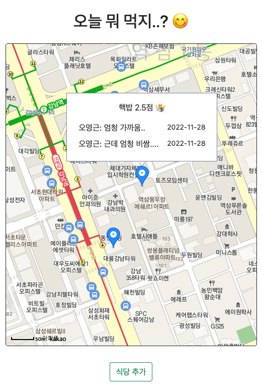

# 점심 지도



회사에서 사용하는 기술 연습용 토이 프로젝트
- 방문한 점포 모델을 추가하고 그 점포에 대한 후기를 작성할 수 있는 기능 제공

### 요구사항 명세

- 점포 검색 + 등록 기능
    - 점포
        - 상호명(name)
        - 위치(lat, long)
        - 평균 평점(rating)
- 팀원들이 먹고서 한줄평과 평점을 줄 수 있는 기능
    - 평점
        - 작성자(commenter)
        - 코멘트(comment)
        - 평점(rating)

### 사용 기술

- django, django rest framework(drf), sqlite
- nextjs, reactjs


### frontend 설치
  * prerequisite - kakao API key 발급, .env에 `KAKAO_APPKEY`값으로 설정 필요

```bash
# frontend
cd frontend
npm install
npm run dev
```

### backend 설치

```bash
# backend
cd backend

# venv 설정
python3 -m venv .venv

# requirements.txt 모듈들 설치
pip install -r requirements.txt

python3 manage.py makemigrate
python3 manage.py migrate
```


